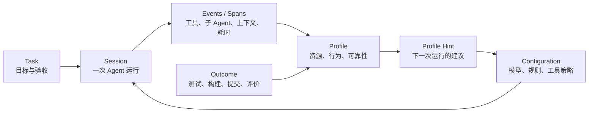

# Agent Runtime Profile 设计方案

> 状态：Proposal
> 目标：将 Agent Profile 从离线会话观察工具，演进为 Agent Runtime 可消费的性能分析与迭代反馈系统。

## 文档地位

本文是未来目标设计，不描述当前已经实现的全部行为。当前实现以
`../ARCHITECTURE.md` 为准，用户入口以 `../README.md` 为准，具体实施状态与验收
证据以 `roadmap.md` 为准。

实现本文中的任一 Phase 前，必须先在 `roadmap.md` 建立明确 Task，写出该阶段的
数据迁移、API/指标兼容、文档更新和验证计划并标记为 `in_progress`。实现结束后，
应先把当前架构及相关领域文档同步为真实状态，再记录验证结果并关闭 Task。Proposal
中的概念、接口和时间阶段在任务完成前均不得被表述为当前能力。

## 1. 定位

**Agent Profile 是 Agent Runtime 的 pprof。**

它不以保存聊天记录为目标，也不把“改提示词”当作唯一能力。它为一次或一组可比较的任务生成运行画像，帮助人和 Agent 回答：

1. 资源花在了哪里（token、成本、时间、上下文、工具、子 Agent）？
2. 过程是否存在异常或退化（失败重试、重复读取、上下文膨胀、无效输出）？
3. 任务结果是否达标（测试、构建、提交、人工验收）？
4. 与同类任务或其他 Agent 配置相比，差异在哪里？
5. 下一次最值得调整的运行策略是什么，以及证据是什么？



### 非目标

- 默认保存完整用户 prompt、完整工具输出或 Chain of Thought。
- 成为实时告警、远程审计或团队监控平台。
- 以单一总分给 Agent 排名。
- 在证据不足时自动改写 Agent 规则或用户提示词。

## 2. 核心概念

| 概念 | 定义 | 当前状态 |
|---|---|---|
| Event / Span | 一次 LLM 回合、工具调用、思考、子 Agent 或结果事件 | 已有 |
| Session | 一次连续的 Agent 执行 | 已有 |
| Task | 用户关心的交付单元；可由一个或多个 session 完成 | 缺失 |
| Configuration | 本次运行采用的模型、规则、工具策略和提示模板版本 | 缺失；已有无持久化的提示词结构审查 |
| Outcome | 可验证的任务结果与人工反馈 | 缺失 |
| Profile | 基于 Session、Configuration、Outcome 的可比较运行画像 | 部分已有 |
| Cohort | 可公平比较的任务集合，如同项目的“功能实现”任务 | 缺失 |
| Experiment | 对同类任务比较不同配置版本的受控试验 | 缺失 |

**Session 是原始过程，Profile 是可行动的解释。** 原始调用记录只能作为证据层，不能替代结果评价或建议。

## 3. 画像维度

Profile 不输出“谁更强”的绝对结论，而是输出适用边界。每项都必须带样本量、比较范围和数据覆盖度。

| 维度 | 指标示例 | 可得到的结论 |
|---|---|---|
| 资源效率 | token、成本、耗时、cache 命中 | 是否以合理代价完成同类任务 |
| 上下文纪律 | 峰值、增长速度、压缩/摘要、重复大输出 | 是否容易陷入上下文膨胀 |
| 执行可靠性 | 工具失败率、重试、失败恢复 | 命令与环境操作是否稳定 |
| 验证质量 | build/test/lint、验证覆盖、返工 | 是否真正收敛到可交付结果 |
| 协作与委派 | 子 Agent 数、委派成本、回收质量 | 委派是否带来净收益 |

示例结论：

> 配置 A 适合复杂重构：测试通过率和上下文稳定性较高，但成本较高。配置 B 适合小修复：速度和成本更优，但复杂任务的工具失败率较高。

## 4. 数据模型

### 4.1 新增实体

```text
tasks
  id, project_id, title, type, goal, acceptance_criteria, status

config_snapshots
  id, agent, model, agent_rules_version, tool_policy_version,
  prompt_template_version, source_hash, created_at

task_sessions
  task_id, session_id, config_snapshot_id, role, started_at, finished_at

task_outcomes
  task_id, build_status, test_status, lint_status, git_commit,
  human_rating, rework_reason, completed_at, evidence_json

experiments
  id, cohort_definition, control_config_id, candidate_config_id,
  primary_metric, guardrails_json, status
```

设计约束：

- `goal`、`acceptance_criteria` 支持“仅结构化字段”模式；原文保存必须显式启用。
- Configuration 使用版本号和 hash，而非复制完整规则文本。
- Outcome 必须区分“未采集”和“失败”，不能将缺失数据误认为失败。
- 一个 Task 可关联多个 Session，支持“中断后续跑”“主/子 Agent 分工”。

### 4.2 标准化 Profile Report

Profile Report 是 Runtime 和 UI 共用的稳定输出，不直接暴露数据库表结构。

```json
{
  "task": { "id": "task-123", "type": "feature_implementation", "status": "completed" },
  "configuration": { "agent": "codex", "model": "gpt-5", "rulesVersion": "v3" },
  "outcome": { "tests": "passed", "build": "passed", "humanRating": "helpful" },
  "profile": {
    "cost": 1.28,
    "totalTokens": 182000,
    "toolErrorRate": 0.04,
    "cacheHitRate": 0.71,
    "peakContextTokens": 82000,
    "verificationCoverage": 0.9
  },
  "comparison": { "cohort": "project-x/feature_implementation", "sampleSize": 18 },
  "findings": [{ "type": "repeated_read", "confidence": "high", "evidence": ["span-12"] }],
  "hints": [{ "priority": "high", "action": "truncate_command_output", "reason": "large output increased context" }],
  "coverage": { "toolInputs": "partial", "toolOutputs": "summary_only", "outcome": "verified" }
}
```

## 5. Agent Runtime 接入

分成事后反馈与运行时反馈两个阶段，前者不要求修改 Agent Runtime。

### 5.1 事后反馈（Phase 1）

Agent 或编排器在任务结束后写入 Task、Configuration、Outcome。系统聚合已有 session/spans，产生 Profile Report。

建议接口：

```text
POST /api/tasks
POST /api/tasks/:id/sessions
POST /api/tasks/:id/outcome
GET  /api/tasks/:id/profile
GET  /api/cohorts/:id/profile-diff
```

### 5.2 运行时反馈（Phase 3）

Runtime 可选接入轻量 SDK，不要求上传思维链：

```text
profile.start(task, configuration)
profile.event(tool_call | tool_result | subagent | verification)
profile.hint()
profile.finish(outcome)
```

`profile.hint()` 只能返回受控建议，例如预算、上下文风险、工具失败模式和同类任务的已验证策略；不得直接生成未验证的规则替换。

示例：

```text
当前上下文处于同类任务 P90；建议先总结已确认结论，再进入下一阶段。
当前 Bash 输出连续两次超阈值；建议缩小命令范围或仅保留失败片段。
```

## 6. 会话与工具调用的展示策略

完整会话记录有必要，但只应是证据层，采用渐进披露。

| 层级 | 默认内容 | 目标用户 |
|---|---|---|
| Task 概览 | 结果、成本、异常、配置差异、建议 | 人和 Agent Runtime |
| Session 时间线 | 回合、工具、子 Agent、文件、验证节点 | 调试与复盘 |
| Event 明细 | 输入摘要、输出摘要、耗时、错误、关联文件/父节点 | 深度排障 |
| 原始记录 | 原始 transcript、完整输入/输出 | 经授权的取证 |

工具调用卡片至少应显示：工具名、目标、耗时、结果、输出大小、错误、父调用、关联文件和是否被诊断命中。

原始输出应默认折叠并支持：分页/虚拟滚动、截断、搜索、按错误/文件/工具过滤，以及敏感信息脱敏。对于解析不到原始内容的 span，明确显示“仅有摘要/大小”，而不是静默留空。

## 7. 人与 Agent 都能理解的透明度规范

每个结论均使用统一卡片：

```text
结论：重复读取导致约 12% 的上下文开销
证据：同一文件在 18 分钟内被 Read 4 次，期间无写入
影响：估算增加 3.2k token；这是启发式估算
建议：读取后缓存摘要；文件变更后才重新读取
置信度：高；数据覆盖：完整工具输入
```

必须显式呈现：

- 指标定义、计算公式与权重；效率分只能称为“过程效率”。
- 归因方法：工具类别按同一回合中的调用占比分摊，并非真实供应商账单。
- 对比范围、样本量和最低样本要求。
- 定价未知、原始内容缺失、无 Git 仓库、未记录 Outcome 等数据缺口。
- LLM 语义诊断是推断，必须附证据 span，且与确定性规则区分展示。

## 8. 提示词与规则优化边界

Prompt 是 Configuration 的一个可实验变量，不是产品中心。

当前已经实现 Phase 0 的局部能力：`prompt-review/v1` 以确定性启发式检查目标、范围、
验收、限制、相关上下文和验证要求；`iteration-hints/v1` 可选择结合现有
`agent-profile/v1` 形成带证据来源、置信度和因果护栏的修改假设。输入只在请求内处理，
不写入数据库，也不调用语义模型；原文证据默认关闭，启用后仅返回经过遮蔽和长度限制
的片段。该能力没有总分，也不会自动改写提示词。

这仍不等于经过验证的提示词优化。正式推荐提示词或 Agent
规则的前提仍是同类 cohort 有足够样本，并同时满足质量 guardrail。例如推荐“要求运行
测试”之前，需证明测试通过率/返工率改善且成本没有超过上限。目前 Task、Configuration
Snapshot、Outcome、Cohort 和 Experiment 均未实现，因此页面建议必须被视为下一次
实验的假设。

## 9. 分期交付

### Phase 0：解释当前 Profile（短期）

当前进度：已实现 `agent-profile/v1` 的 Agent 级过程画像、覆盖度、最低样本约束和
人类可读差异页；也已实现无持久化的提示词结构审查与受控迭代假设。诊断卡片与完整
事件时间线的统一透明度仍属于后续任务。运行画像只基于 Session/Span，Outcome
明确标记为未采集，提示词建议也尚不能通过 Outcome 闭环验证。

- 为现有指标增加定义、公式、数据覆盖与限制说明。
- 将诊断改为“结论 + 证据 + 影响 + 建议 + 置信度”。
- 将原始工具调用改为按需展开的时间线。

验收：用户可在不阅读代码的情况下理解任一异常、效率分和成本归因的来源。

### Phase 1：Task 与 Outcome（核心）

- 引入 Task、Configuration Snapshot、Outcome、Task-Session 关联。
- 支持 test/build/lint/Git/human rating 的结果录入。
- 生成 Task Profile Report，并支持导出 JSON。

验收：可判断某个配置在同类任务中是否提高了完成质量，且不会将“未采集结果”误判为失败。

### Phase 2：Cohort 与 Experiment

- 定义 cohort：项目、任务类型、复杂度区间、Agent/模型。
- 支持控制组/候选配置对比，展示主要指标与 guardrail。
- 建立回归检测：质量下降、成本激增、失败率上升。

验收：一次规则或模型变更能得到“保留/回滚/证据不足”的明确结论。

### Phase 3：Runtime Feedback

- 提供 Runtime SDK/HTTP 事件适配器。
- 提供 `hint` 接口和预算/上下文/失败策略。
- 支持 Agent 在下一次或执行中消费 Profile Report。

验收：Runtime 能在不上传原始思维链的情况下，根据已验证策略改变执行计划，并被后续 outcome 评估。

## 10. 成功指标与护栏

产品北极星指标：**有可验证下一步行动的已完成任务占比**。

辅助指标：

- 记录 Outcome 的 Task 占比。
- 同类任务中可比较配置的覆盖率。
- 推荐被采纳后的 guardrail 通过率。
- 用户查看原始记录后仍无法解释异常的比例。

护栏：不得以降低 token 或成本为唯一优化目标；测试/构建/人工结果缺失时，禁止宣称配置“更好”。

## 11. 待决策项

1. Task 由用户手动创建、由 Agent Runtime 创建，还是从 session 标题自动建议？建议支持自动建议、人工确认。
2. Outcome 的最小必填项是什么？建议为 `status + 至少一个验证证据或人工评价`。
3. 配置快照是否保存规则全文？建议默认仅存版本/hash，全文在本地显式授权后保存。
4. Phase 3 是否优先接入 Codex，还是先定义独立的 OpenTelemetry 风格事件协议？建议先定义独立协议，再为各 Agent 写适配器。
